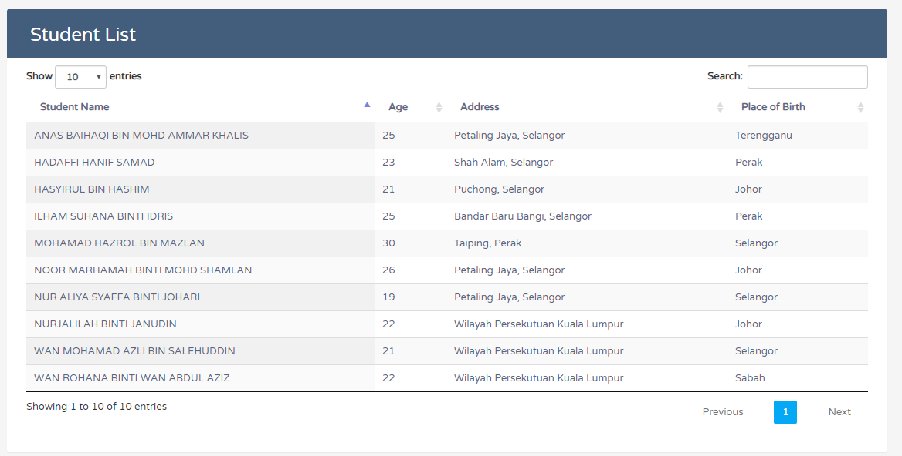

# CRUD using Spring Boot, Rest API & MySQL
*by Amira Azman*

## Steps to Setup

**1. Clone the application**

```bash
git clone https://github.com/MiraAzman/springboot.git
```

**2. Restore Mysql dump file**

+ the dump file is in `database`

```bash
mysql -u <user> -p < db.sql
```
**3. Change mysql username and password as per your installation**

+ open `src/main/resources/application.properties`

+ change `spring.datasource.username` and `spring.datasource.password` as per your mysql installation

**4. Run the app using maven**

```bash
mvn spring-boot:run
```

The app will start running at <http://localhost:8080>.

## RESTful API Server ##

METHOD | PATH | DESCRIPTION 
------------|-----|------------
GET | /api/students/ | get all students
GET | /api/students/{student_id} | get student by student id
PUT | /api/students/{student_id} | update student
DELETE | /api/students/{student_id} | delete student

## DataTable in Client Side ##

DataTable is used to view student list retrieved from REST api. 
You can access thru <http://localhost:8080/index.html>.


